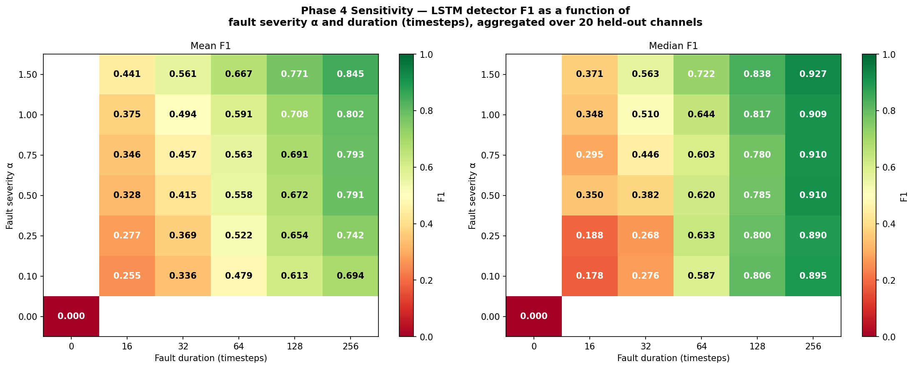
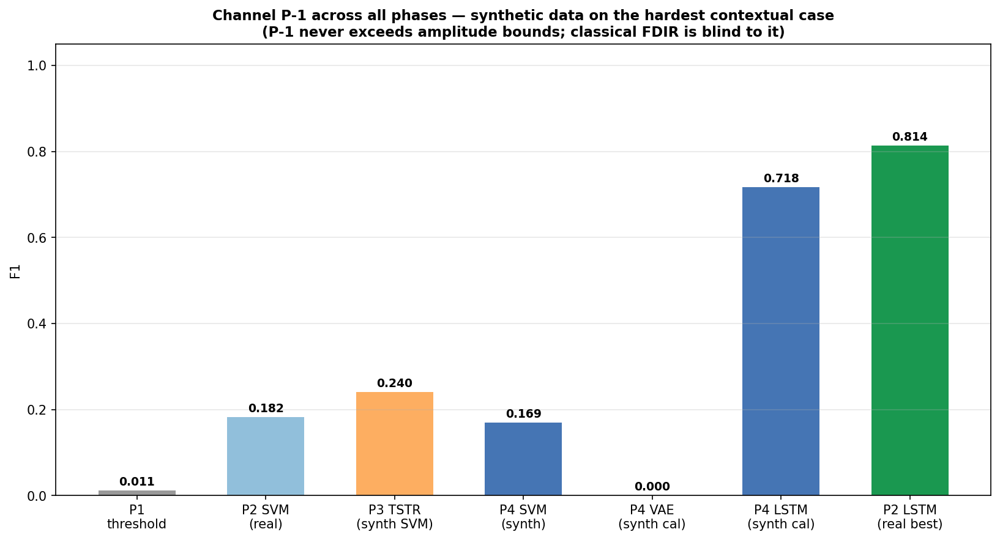
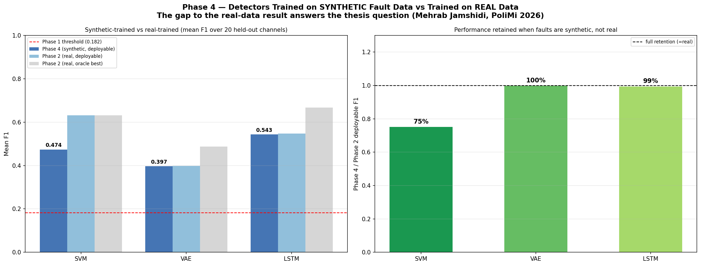

# Generative Digital Twin Methods for Spacecraft Telemetry Anomaly Detection

### Toward Data-Driven FDIR Design and Testing

Synthetic fault data from a class-conditional WGAN-GP, evaluated as a substitute for real
labelled faults **and** as a controllable fault source for FDIR design, on the **NASA SMAP/MSL**
telemetry benchmark — under a **leak-free, channel-level held-out protocol**.

> MSc thesis in Aeronautical Engineering — Ingegneria Aeronautica.
> Candidate: **Mehrab Jamshidi** (10976258) — Advisor: **Prof. Andrea Colagrossi**.
> Politecnico di Milano, Department of Aerospace Science and Technology, Academic Year 2025–26.
>
> 📄 Full thesis: [`docs/Mehrab_Jamshidi_thesis.pdf`](docs/Mehrab_Jamshidi_thesis.pdf) ·
> 📄 One-page summary: [`docs/Mehrab_Jamshidi_Thesis_OnePager.pdf`](docs/Mehrab_Jamshidi_Thesis_OnePager.pdf)

---

## What this repository is

Classical model-based FDIR (running-variance / 3σ thresholding) is structurally blind to
**contextual** anomalies — faults that stay within normal amplitude bounds but change the
signal's temporal pattern, such as a slow gyro drift. They are not an edge case: **43 of the
105** labelled anomalies in this benchmark are contextual (the other 62 are point anomalies).
Across the 81 unique channels a 3σ amplitude detector reaches a **mean F1 of 0.183 and a median
of 0.019** — 35 channels score exactly zero — collapsing to **0.052** on contextual channels.

This project asks whether a **generative model** trained on real telemetry can

1. **substitute** for scarce real fault labels when training detectors, and
2. act as a **controllable fault generator** that maps a detector's response across the
   fault-parameter space — something a fixed set of real labels can never do.

The second turns out to be the answer that matters.

### The methodological correction at the centre of this work

An earlier version of this pipeline trained the GAN on anomaly windows drawn from the **test**
split and then evaluated synthetic-to-real detection on that same split, so the synthetic
distribution was shaped by the very anomalies used for evaluation. **Everything here is re-run
under a clean channel-level hold-out:** the 81 channels are split into 61 training and 20
held-out (stratified by anomaly class, seed 42); the generator never sees the held-out
channels, and every reported number is measured only on those 20 unseen channels.

A per-channel anomaly holdout is impossible — 63 of the 81 channels have only **one** labelled
anomaly sequence — so the channel is the only clean unit. The reasoning is written up in
[`docs/CLEAN_RERUN_PROTOCOL.md`](docs/CLEAN_RERUN_PROTOCOL.md).

---

## Key results (20 held-out channels)

| Experiment | Result |
|---|---|
| **Synthetic-vs-real substitution (SVM)** | synthetic **0.474** vs real **0.631** — paired Wilcoxon **p = 0.13** (no detectable difference) |
| **VAE deployable threshold** | classical k3 **0.397** (within-run oracle 0.486); no synthetic rule beats k3 (best vs k3 p = 0.29) |
| **LSTM deployable threshold** | classical k3 **0.543** (within-run oracle 0.614); the synthetic "win" is a grid artefact (p = 0.69) |
| **GAN fidelity** | TSTR **0.474** on held-out (0.57 point / 0.24 contextual); Fréchet — contextual 0.141, point 0.403; ACF \|Δ\| — contextual 0.026, point 0.015 |
| **Data-efficiency** | flat (0.474 → 0.465) — cross-channel real labels do not transfer; equivalent-windows claim withdrawn |
| **Augmentation** | synthetic *substitutes for* cross-channel real (both ≈ 0.47) but does *not* augment it |
| **Sensitivity (the design contribution)** | F1 surface **0.255 → 0.845** over fault severity α × duration d; latency < 1 → ~30 steps; **duration dominates severity** |
| **Showcase channel P-1** (contextual, unseen) | classical 0.011 → nominal-trained k3 LSTM **0.718** (real-data best 0.814) |

Every comparison against real data is tested with a paired Wilcoxon signed-rank test (n = 20).
The central message is preserved but properly hedged: synthetic faults substitute for real ones
with no detectable loss, the parameter-free k3 rule remains the recommended deployable
threshold, and the **decisive, uncontaminated** value of the generator is the controllable-fault
sensitivity sheet that the real dataset cannot produce.

### The headline figure — detector response as a function of fault severity and duration



This is the deliverable a real FDIR designer wants and that labelled flight data cannot give
you: *how big must a fault be, and how long must it last, before the detector catches it — and
how quickly?* Detection quality rises monotonically in both parameters, from F1 = 0.255 in the
faint/short corner to 0.845 in the large/long corner.

The practical lesson is that **duration dominates severity**. Sweeping duration at fixed
α = 0.1 moves F1 by 0.44; sweeping severity at fixed d = 16 moves it by only 0.19. A long faint
fault is far more detectable than a short loud one. The α = 0 control row measures the
false-positive rate of the k3 threshold on untouched nominal data — **median 0.011**, which is
what makes the rest of the surface interpretable; the mean is far higher at 0.123, inflated by
two channels (D-5, R-1) that flag their entire clean stream. Both are reported so the floor is
not understated.

### P-1: a contextual fault the classical detector cannot see



P-1 is the thesis's showcase contextual channel, and the clean split happens to place it in the
**held-out** set — so this is a genuine unseen-generalisation result. The 3σ amplitude detector
scores 0.011: effectively blind. An LSTM trained only on *nominal* data and thresholded with
the parameter-free k3 rule reaches **0.718**, against 0.814 for the best real-data-trained
detector — no real fault labels required.

### Cross-phase overview



---

## Repository layout

```
.
├── README.md
├── requirements.txt
├── AI_use_declaration.md
├── LICENSE
├── docs/
│   ├── Mehrab_Jamshidi_thesis.pdf              # the full thesis
│   ├── Mehrab_Jamshidi_Thesis_OnePager.pdf     # one-page summary
│   ├── CleanReRun_Report_Revised_FINAL.pdf     # the corrective report in full
│   └── CLEAN_RERUN_PROTOCOL.md                 # protocol design notes
├── src/
│   ├── config.py                               # ALL paths — set SMAP_MSL_ROOT and nothing else
│   ├── holdout_split.py                        # SHARED 61/20 split — imported by Phase 3 & 4
│   ├── phase1_baseline/
│   │   ├── smap_visualization_v2.py            # z-score 3σ threshold baseline + telemetry viz
│   │   ├── svm_ann_classification.py           # supervised SVM / ANN baselines
│   │   └── simulink/                           # drift-fault detection-gap demo
│   │       ├── spacecraft_fdir.slx
│   │       └── spacecraft_fdir_m.m
│   ├── phase2_detectors/
│   │   ├── vae_anomaly_detection.py
│   │   ├── vae_point_adjust.py                 # Hundman-comparable point-adjust protocol
│   │   └── lstm_regression.py
│   ├── phase3_gan/
│   │   └── wgan_gp_clean.py                    # class-conditional WGAN-GP, 61 train channels only
│   └── phase4_synthetic_to_real/
│       ├── phase4_synthetic_training.py        # SVM/VAE/LSTM substitution + thresholds + data-efficiency
│       ├── phase4_extensions.py                # augmentation grid
│       └── phase4_sensitivity.py               # controllable-fault α × d sweep (F1 + latency)
├── data/
│   ├── README.md                               # how to obtain the NASA dataset (not committed)
│   ├── clean_split_assignment.csv              # the 61/20 channel assignment
│   └── synthetic/                              # GAN output consumed by Phase 4
│       ├── gan_v4_clean_synth_point.npy
│       └── gan_v4_clean_synth_contextual.npy
├── models/                                     # trained GAN weights (exact reproduction)
├── results/                                    # all result tables (CSV)
└── figures/                                    # all figures (PNG)
```

Each script carries a long header docstring explaining what it does, why it is designed that
way, and what it found — start there rather than with the code.

---

## Dataset

The NASA SMAP/MSL benchmark (Hundman et al., 2018) is **not** committed. Download it and point
the code at it with one environment variable:

```bash
export SMAP_MSL_ROOT="/path/to/archive/data/data"        # bash / zsh
$env:SMAP_MSL_ROOT = "D:\...\archive\data\data"          # PowerShell
```

See [`data/README.md`](data/README.md) for the download link, the expected folder layout, and
the windowing/normalisation conventions used identically across all four phases. Every script
validates the dataset at startup and fails with the exact path it looked for.

---

## Installation

```bash
git clone https://github.com/Mehrab-Jamshidi/spacecraft-fdir-generative-twin.git
cd spacecraft-fdir-generative-twin
python -m venv .venv && source .venv/bin/activate   # Windows: .venv\Scripts\activate
pip install -r requirements.txt
```

Requires **Python 3.12**. A CUDA GPU is recommended — the reference environment was
torch 2.5.1+cu121 on an RTX 3050 — but the scripts fall back to CPU.

---

## Reproducing the results

All scripts import the single `holdout_split.py`, so the 61/20 partition is identical at every
stage and cannot drift. Run from the repository root; outputs land in `results/` and `figures/`
regardless of where you invoke them from.

First, confirm the split — this takes a second and validates your whole setup:

```bash
python src/holdout_split.py
```

It must print 61 training channels, 20 held out, and this held-out set:

```
A-8, B-1, C-1, D-14, D-4, D-5, D-9, E-10, E-8, F-3, G-1, G-2,
G-3, G-4, M-2, P-1, P-2, R-1, T-2, T-5
```

**Option A — reuse the committed synthetic data (no GAN training):**
Phase 4 reads `data/synthetic/gan_v4_clean_synth_*.npy` directly.

```bash
python src/phase4_synthetic_to_real/phase4_synthetic_training.py
python src/phase4_synthetic_to_real/phase4_extensions.py
python src/phase4_synthetic_to_real/phase4_sensitivity.py
```

**Option B — full pipeline from scratch (retrains the GAN):**

```bash
# 1. Baselines (optional; establishes the classical detection floor)
python src/phase1_baseline/smap_visualization_v2.py
python src/phase1_baseline/svm_ann_classification.py
# 2. Unsupervised detectors (optional)
python src/phase2_detectors/vae_anomaly_detection.py
python src/phase2_detectors/vae_point_adjust.py
python src/phase2_detectors/lstm_regression.py
# 3. Clean GAN — trains on the 61 training channels only, writes gan_v4_clean_synth_*.npy
python src/phase3_gan/wgan_gp_clean.py
# 4. Synthetic-to-real evaluation on the 20 held-out channels
python src/phase4_synthetic_to_real/phase4_synthetic_training.py
python src/phase4_synthetic_to_real/phase4_extensions.py
python src/phase4_synthetic_to_real/phase4_sensitivity.py
```

Full run ≈ 90 min on a single RTX 3050; the GAN is the only long, GPU-heavy step. Because every
model is seeded, the F1 and latency surfaces reproduce to four decimals.

---

## Method, in one paragraph each

- **Phase 1 — baselines.** A z-score 3σ threshold detector (mean F1 0.183, median 0.019 across
  the 81 channels; 0.052 on contextual channels) plus supervised SVM/ANN classifiers,
  establishing the classical detection floor. A Simulink drift-fault simulation shows the same
  gap in a controlled spacecraft-attitude setting: a gyroscope drift injected at t = 300 s
  drives the estimation error to ~14 deg/s while the running-variance monitor never trips.
- **Phase 2 — unsupervised detectors.** A VAE (reconstruction error, 0.590 mean / 0.638
  contextual at the oracle threshold) and an LSTM (one-step-ahead prediction error, 0.743 mean
  / **0.836 contextual**), both trained on nominal data only. The LSTM reproduces the Hundman
  et al. (2018) SMAP benchmark to within **0.006** (0.746 vs 0.752), which independently
  validates the whole pipeline. These are the detectors whose thresholds Phase 4 tries to set
  with synthetic data.
- **Phase 3 — clean generator.** A class-conditional WGAN-GP trained **only** on anomaly
  windows from the 61 training channels, with four architectural contributions over a standard
  conditional WGAN-GP: a 1-D convolutional generator and critic, an explicit
  autocorrelation-matching loss, per-class specialised generators, and a spectrally normalised
  critic compatible with the gradient penalty.
- **Phase 4 — synthetic-to-real.** Three questions on the 20 held-out channels: can synthetic
  faults *substitute* for real labels (SVM); can they *set a deployable threshold* better than
  3σ (VAE, LSTM); and — the core contribution — what does the detector's F1-and-latency
  response look like as a **continuous function of fault severity and duration**, using the GAN
  as a controllable fault source.

---

## Notes on rigour

- **This is not a Digital Twin.** There is no synchronised virtual replica of a specific
  spacecraft, no automated physical-to-digital or digital-to-physical data flow, and no
  closed-loop reconfiguration. What is developed here are the generative *methods* that would
  form the learning and fault-management layer of a Cognitive (Level 5) Digital Twin in the
  maturity framework of Wei et al. The phrase "generative Digital Twin methods" should be read
  in exactly that sense — methods directed *toward* such a twin, not a twin delivered.
- **Point-adjust inflates absolute F1.** As Kim et al. (2022) show, crediting a whole
  ground-truth segment when any single step inside it is flagged raises scores substantially on
  datasets with long anomaly segments. It is used here because it is the protocol under which
  the Hundman et al. benchmark is reported, and it is applied identically to every method — so
  the *relative* ordering of methods, on which the argument rests, is unaffected. Absolute
  values are benchmark-comparable under point-adjust, not point-wise scores.
- Results are reported on a **single** stratified 61/20 split (n = 20). Significance is
  therefore reported as the *absence of a detectable difference* (paired Wilcoxon), not as
  proof of equality. The SVM substitution gap is 0.157, 95% CI [−0.04, +0.35] — wide, and
  spanning zero.
- The synthetic **point**-class fidelity (Fréchet 0.403) is weaker than the contextual class
  (0.141): synthetic point windows are slightly smoother than the sharpest real spikes. This is
  disclosed and does not undermine downstream detection (the amplitude-sensitive SVM reaches
  0.651 on point channels in Phase 2).
- The four architectural contributions were adopted together and motivated qualitatively; their
  individual marginal effect was **not** isolated in a controlled ablation, and no
  nearest-neighbour memorisation check was run.
- The sensitivity surface characterises detectability of **generator-produced** faults
  parameterised by the injection model, not of arbitrary physical faults; extrapolating it to
  real graded faults rests on the generator's realism and is not yet validated.
- "Oracle" appears in two distinct senses: the **within-run** oracle (best threshold for the
  Phase-4 detector, bounding the threshold-rule study) and the **real-data** oracle (best
  real-trained detector, shown for reference). They are labelled separately wherever they appear.
- Per-cell standard deviation on the sensitivity surface is large (0.22–0.35), because channels
  differ a lot in how detectable their dynamics are. The **shape** of the surface is the robust
  finding, not any individual cell.
- **One reference column is not on the clean footing.** The `p3_tstr_f1` column of
  `results/phase4_master_comparison.csv` — and the corresponding "P3 TSTR" bar in the P-1
  figure — is read from the *pre-held-out* generator's TSTR table
  (`results/gan_v3_tstr_results.csv`), which was trained on all channels including these 20, so
  it is optimistic on exactly them: **0.487**, against **0.450** for the clean generator scored
  on the same channels. This column is what appears as the `TSTR` column of the thesis's
  Table B.2 (mean 0.487), whereas the thesis text in §4.6 reports the held-out transfer as
  **0.474** — the clean synthetic-trained SVM (`svm_p4_f1`; 0.57 point / 0.24 contextual, which
  matches §4.6 exactly). Two different quantities travel under one name. The column is kept
  as-is here so the code reproduces the committed tables and figures exactly; no headline
  result, significance test, or other figure depends on it. The comment in `build_master()` in
  `phase4_synthetic_training.py` explains how to switch it to the clean table.

---

## AI-use disclosure

Large-language-model assistants (ChatGPT, Claude) were used as an aid for writing, coding, and
sanity-checking, disclosed in full in [`AI_use_declaration.md`](AI_use_declaration.md). All
research objectives, experimental design, execution, and scientific conclusions are the
author's own, and all reported numbers were verified against the underlying data.

## Citation

```bibtex
@mastersthesis{jamshidi2026generative,
  title  = {Generative Digital Twin Methods for Spacecraft Telemetry Anomaly
            Detection: Toward Data-Driven {FDIR} Design and Testing},
  author = {Jamshidi, Mehrab},
  school = {Politecnico di Milano, Department of Aerospace Science and Technology},
  type   = {MSc thesis in Aeronautical Engineering},
  year   = {2026}
}
```

## Contact

**Mehrab Jamshidi** — MSc Aeronautical Engineering, Politecnico di Milano (2026)
[mehrab.jamshidi@mail.polimi.it](mailto:mehrab.jamshidi@mail.polimi.it) ·
[LinkedIn](https://www.linkedin.com/in/mehrab-jamshidi-861a71258/)

Questions about the method, the evaluation protocol, or reproducing the results are welcome.
I am currently looking for doctoral and research positions in data-driven fault detection,
condition monitoring, and learning for safety-critical systems.

## License

Released under the [MIT License](LICENSE). The NASA SMAP/MSL dataset is the property of its
original authors and is not redistributed here.
